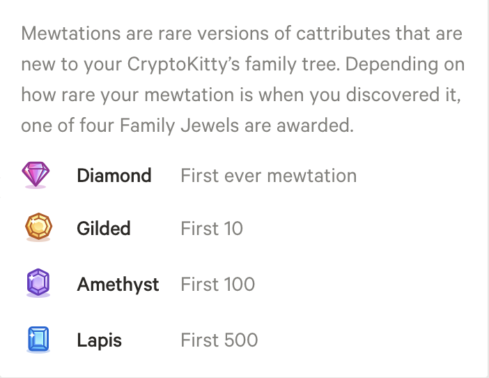
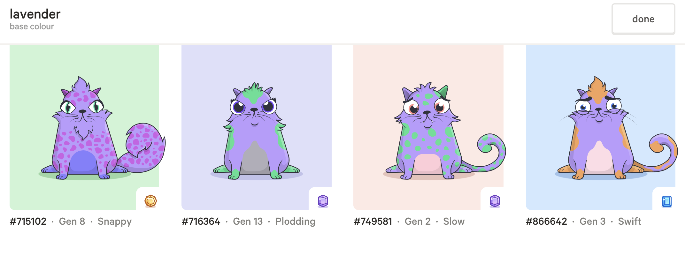

# Family Jewels

A web application to display the CK players with the best collection of family jewels.

### How to use the website locally:
1. Launch development server with ```npm start``` and visit ```localhost:3000```
2, When finished with the application, close the server with ```^c```

### User Stories:
```
As an ethereum whale
So that I know how great I am   
I want to see a list of the top players ranked by collection of family jewels

As an ethereum whale
So that I know how much better than other players I am
I want to see a score for all family jewel collectors

As an ethereum whale
So that I have the latest rankings
I want the leader board to be updated regularly

As an aspiring collector
So that I know who the competition are
I want to see the collector's account name on the leader board

As an aspiring collector
So that I know exactly what cats the competition have
I want to be able to click through from the leader board to view a game profile
```

### System Requirements:
```
As a system
So that I can calculate the best family jewel collection
I want to query the API for all of the 32,000 possible jewels

As a system
So that I can assign points per player per jewel
I want look up the metamask account of each jewelled CK player

As a system
So that I can assign 100 points to an account for with a diamond jewel
I want to keep a tally of jewels per player per trait

As a system
So that I can assign 25 points to an account for with a gilded jewel
I want to keep a tally of jewels per player per trait

As a system
So that I can assign 5 points to an account for with a amethyst jewel
I want to keep a tally of jewels per player per trait

As a system
So that I have a fair and engaging league
I want to only award points once for the top jewel per player per trait

```

### Reference Points:

Background on mewtation jewels:

- 320 possible mewtations/traits/cattributes in the game,
- Each mewtation has 100 of the top 3 jewels awarded (1 diamond, 9 gilded and 90 amethyst).
- For the top three jewel categories there is a maximum 32,000 jewels awarded to players. This is static for the duration of the game.
- Total possible 32,000 cats to query but some mewtations will not actually exist so less.
- Not all of the mewtations have come into play yet, so some jewels are yet to be awarded.

All 4 available jewels in the game (not including lapis in the leader board for first iteration):



Example of a player's family jewels for a single trait. For this trait the player would be awarded 25 points for the gilded, as it's their top jewel. No points would be awarded for the lesser jewels:



Identification of players:

- A player is identifiable via their metamask address
- CK profile URL can be concatenated with the metamask address
- CK API data includes metamask address for each jewelled cat owner

### Mockup:
Web (full screen) optimised:


### Code Style:
JavaScript and node.js

### Code Example:
```
```

### Approach to the build:
1. Investigate the CK Public API using Postman to test a range of endpoints and see the full scope of data available. API documentation is [here](https://docs.api.cryptokitties.co/). Realise that the cats are not listed with the specific data required for the mewtation jewels leader board.
2. If possible, the CK game developers would prefer that data is not stored locally, but that the API is pinged as often as needed as they are collecting data on the endpoints.
3. Consider server rendered application as it'll rank higher in search engine results and thus potentially gain more traffic.
4. CK API is paginated and currently over 17,000 items to gather data for, therefore research options for calling the data. Can adjust the limit from 12 to 200 and still return the response object in 1145ms but still need minimum 85 concurrent API calls. Potentially use a recursive function but would still be making 170+ api calls each time the data is scraped from the game. Also need to consider how to avoid this operation being blocking.
5. Consider a [stream](https://developer.mozilla.org/en-US/docs/Web/API/Streams_API) for accessing data. Also potential that a Graph QL interface might help but still need to access the full set of data in a series of API calls.
6. Consider error handling - as the site will be fully dependent on the available data need to have a system for reporting if there is an error accessing data from the API.
7. Set up Express app to serve the application. Selected [request-promise](https://www.npmjs.com/package/request-promise) for simple HTTP request client with promise support. 
